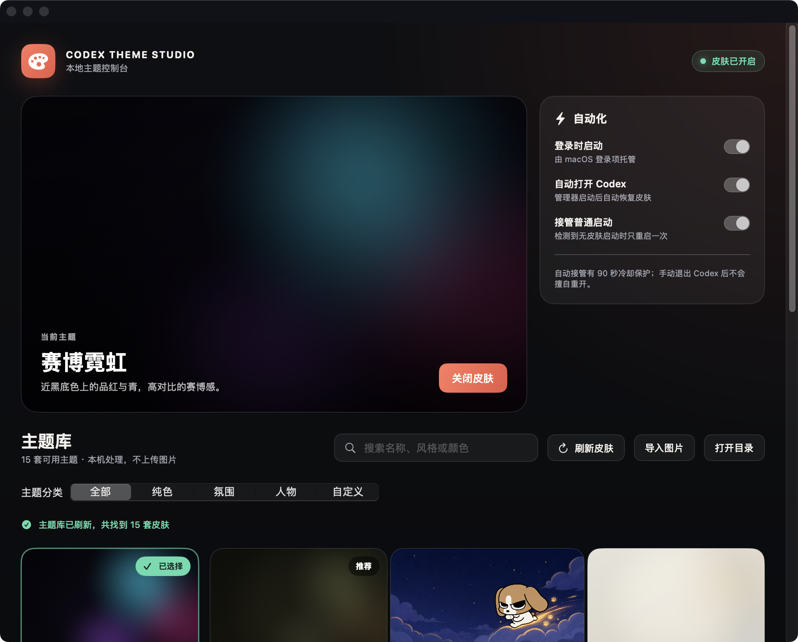

# Codex Theme Studio

<p align="center">
  <strong>中文</strong> · <a href="./README.en.md">English</a>
</p>

<p align="center">
  <strong>给 Codex 桌面端换一张会呼吸的脸。</strong><br>
  外部主题 / 换肤工具 · 本机 CDP 注入 · 不改官方安装包
</p>

<p align="center">
  一张图，一种心情 · 写代码，也要有氛围感
</p>

<p align="center">
  非 OpenAI 官方产品。不修改 <code>.app</code> / <code>app.asar</code> / WindowsApps。
</p>

<p align="center">
  <a href="https://github.com/Keith9922/Codex-Theme-Studio/releases/latest">
    
  </a>
  <a href="https://github.com/Keith9922/Codex-Theme-Studio/releases">
    
  </a>
  
  
  <a href="./macos/LICENSE">
    
  </a>
</p>

<p align="center">
  <a href="https://codex-theme-studio.zhangrg9922.chatgpt.site"><strong>产品官网</strong></a>
  · <a href="https://github.com/Keith9922/Codex-Theme-Studio/releases/latest"><strong>下载最新版</strong></a>
  · <a href="#一分钟开始">安装指南</a>
  · <a href="./skills/create-codex-theme/SKILL.md">制皮 Skill</a>
  · <a href="./README.en.md">English</a>
</p>

<p align="center">
  
</p>

**Codex Theme Studio** 是面向官方 Codex Desktop 的非官方主题管理器。它用一个原生 macOS 工作台统一完成主题预览、搜索、刷新、热切换、开机启动和背景图导入；皮肤通过仅监听本机的 CDP 加载，不拆包、不修改官方应用签名。

## 一分钟开始

1. 从 [Releases](https://github.com/Keith9922/Codex-Theme-Studio/releases/latest) 下载 `Codex-Theme-Studio-macOS-*.zip`。
2. 解压后把 `Codex Theme Studio.app` 移到“应用程序”或 `~/Applications`；首次打开如被拦截，请在 Finder 中右键选择“打开”。
3. 选择主题并开启皮肤。之后切换主题使用热更新，不会反复重启 Codex。

> 当前公开构建采用 ad-hoc 签名、尚未 Apple 公证。支持 macOS 13+、Apple Silicon 与 Intel Mac；项目不收集主题图片，也不会把本机私人主题自动上传或打入公开 Release。

## 分享亮点

- **一个开关管理生命周期**：启用或关闭时只执行一次受控重启，避免重复注入造成闪退。
- **原生主题工作台**：搜索、分类、预览、刷新本机皮肤资产，活动会话中一键热切换。
- **开机自动恢复**：可选登录时启动、自动打开 Codex 和普通启动后的单次接管。
- **主题可生成、可安装**：内置 `create-codex-theme` Skill，用自然语言搜索现有主题或生成新皮肤。
- **保留官方完整交互**：侧栏、任务、插件、输入框仍是 Codex 原生控件，不是整窗截图。
- **明确安全边界**：CDP 只绑定 `127.0.0.1`，不修改官方 `.app`、`app.asar` 或代码签名。

## 赞助商

<p align="center">
  <a href="https://passion8.cc/register?aff=TuPe">
    
  </a>
</p>

<p align="center">
  <strong>更智能的连接 · 更热爱的创造</strong><br>
  <sub>热爱驱动 · 无限可能 · Connect AI · Power Creation</sub>
</p>

<p align="center">
  感谢 <a href="https://passion8.cc/register?aff=TuPe"><strong>passion8.cc</strong></a> 赞助本项目。<br>
  满血 AI 中转：官方模型直连，无降智、无套壳；一行配置接入 Codex / Claude Code / Grok。
</p>

<p align="center">
  <sub>
    换肤与 API 配置互相独立，本项目不会自动改写你的模型供应商设置。
  </sub>
</p>

## 实测精选预设

### Gothic Void Crusade / 哥特虚空远征

**特别感谢 [@seansong-ideogram](https://github.com/seansong-ideogram) 为社区设计并贡献这套精美、极具氛围感的原创哥特科幻作品。** 它是当前实测精选的第一套预设，也是 macOS 全新安装时默认启用的主题。

<p align="center">
  <br>
  <sub>真实 Codex 首页注入效果（仅预览）</sub>
</p>

macOS 安装后可从「已保存主题」直接切换，也可以运行：

```bash
~/.codex/codex-dream-skin-studio/scripts/switch-theme-macos.sh \
  --id preset-gothic-void-crusade
```

### 桥本有菜 / Arina Hashimoto

下面这套「桥本有菜 / Arina Hashimoto」已经在真实 Codex 首页分别验证浅色和暗色外观。用户提供的源 PNG 为 `1672 × 941`，主题包在保持源图近 16:9 构图的前提下派生导出 `2560 × 1440` JPEG，并不代表增加了源图细节。截图中的侧栏、卡片、项目选择和输入框都是 Codex 原生控件。

<p align="center">
  <br>
  <sub>浅色 · 真实注入截图（未发送输入已在截图时遮蔽，仅预览）</sub>
</p>

<p align="center">
  <br>
  <sub>暗色 · 真实注入截图（未发送输入已在截图时遮蔽，仅预览）</sub>
</p>

从仓库安装并一键切换（macOS）：

```bash
cd macos
./scripts/install-dream-skin-macos.sh --no-launch
~/.codex/codex-dream-skin-studio/scripts/switch-theme-macos.sh \
  --id preset-arina-hashimoto
```

Windows 使用本地主题仓库与系统托盘，并会预置同一套「桥本有菜」。首次从仓库使用：

```powershell
powershell -ExecutionPolicy Bypass -File .\windows\scripts\install-dream-skin.ps1
powershell -ExecutionPolicy Bypass -File .\windows\scripts\start-dream-skin.ps1
```

启动后可直接从「已保存主题 → 桥本有菜」切换；不需要跨目录手动导入。托盘里的「更换背景图」仍可导入你自己的纯背景，保存后继续一键切换。

> 可下载的用户源图是 [`docs/images/presets/arina-hashimoto-source.png`](./docs/images/presets/arina-hashimoto-source.png)（`1672 × 941`）；macOS 一键预设使用 [`macos/presets/preset-arina-hashimoto/background.jpg`](./macos/presets/preset-arina-hashimoto/background.jpg)（规范化派生 `2560 × 1440`）。上面两个效果图包含真实 UI，**只作预览，绝不能当背景导入**。背景为用户提供的 AI 生成示例，不代表 OpenAI/Codex 官方视觉或背书；公开再分发前请确认人物与素材权利。

## 概念效果图（不可直接导入）

下面八张图用于表达可实现的视觉方向，但它们是带界面的概念效果图，不是可直接使用的主题背景。需要同类效果时，先按[参考生图提示词](./docs/reference-background-prompt-guide.md)生成无 UI 的 `2560 × 1440` 素材；八种风格的详细拆解见[概念图提示词](./docs/background-generation-prompts.md)。

<p align="center">
  <br>
  <sub>粉系定制</sub>
</p>

<p align="center">
  <br>
  <sub>财神打工版</sub>
</p>

<p align="center">
  <br>
  <sub>红白科幻</sub>
</p>

<p align="center">
  <br>
  <sub>清透定制</sub>
</p>

<p align="center">
  <br>
  <sub>灵感小宇宙</sub>
</p>

<p align="center">
  <br>
  <sub>紫夜限定</sub>
</p>

<p align="center">
  <br>
  <sub>青蓝虚拟歌姬</sub>
</p>

<p align="center">
  <br>
  <sub>舞台黑金</sub>
</p>

## 它能做什么

- **原生 Mac 工作台**：搜索、分类、预览、刷新主题资产、开关和热切换主题，可选登录时启动
- **真·可交互**：侧栏、建议卡、项目选择、输入框都是原生控件，不是整窗假截图贴上去
- **真背景层**：一张 16:9 纯壁纸连续铺满整窗，首页突出氛围，任务页自动降低干扰
- **可换图**：换一张喜欢的纯背景，自适应焦点、安全区和配色后变成你的主题
- **可存主题**：macOS 菜单栏与 Windows 系统托盘都能保存/切换本地主题
- **可恢复**：一键还原官方外观
- **相对安全**：本机回环 CDP 注入，不改官方二进制与签名

## macOS App 与制皮 Skill

macOS 13+ 可直接使用 Release 中的 `Codex Theme Studio.app`。应用内置
**赛博霓虹、野生博物、钴蓝工坊、朱砂信号、瓷白纸页**等零版权风险的
程序化主题，并能搜索本机已有皮肤。

仓库同时提供 [`create-codex-theme`](./skills/create-codex-theme/SKILL.md)
Skill。用户只需描述想要的颜色、氛围、人物和构图；Skill 会先搜索现有主题，
找不到时再生成背景、校验主题包并导入。默认不会重启 Codex，只有明确要求
立即应用时才会启动或重启。

普通用户可直接阅读 [`create-codex-theme 使用指南`](./skills/create-codex-theme/README.md)，其中包含下载、安装、一句话示例、App 刷新识别、多主题切换和必要声明。

## 快速开始

仓库内按平台放了现成脚本（实现细节不同，效果都是「主题化 Codex」）：

| 平台 | 目录 | 入口 |
|------|------|------|
| Apple Silicon / Intel Mac | [`macos/`](./macos/) | 使用 Release 中的 `Codex Theme Studio.app` |
| Windows | [`windows/`](./windows/) | `scripts/install-dream-skin.ps1` → `start-dream-skin.ps1` |

更细的说明：

- Mac：[`macos/README.md`](./macos/README.md)
- Windows：[`windows/SKILL.md`](./windows/SKILL.md)
- 路径对照：[`docs/platforms.md`](./docs/platforms.md)
- 可直接复制的参考生图模板：[`docs/reference-background-prompt-guide.md`](./docs/reference-background-prompt-guide.md)
- 八种概念方向详细提示词：[`docs/background-generation-prompts.md`](./docs/background-generation-prompts.md)
- 项目记录：[`docs/PROJECT.md`](./docs/PROJECT.md)

## 反馈与贡献

- **Issue：** 请用 [Issue 模板](./.github/ISSUE_TEMPLATE/)（Bug / 功能）；已关闭空白 Issue。提交前建议先跑 Verify / Restore 自检。
- **PR：** 请按 [PR 模板](./.github/pull_request_template.md) 写清改动，并勾选对应自测（如 `macos/tests/run-tests.sh`、verify / restore）。

## 安全边界

- CDP 只绑 `127.0.0.1`，主题运行期间勿跑来路不明的本机程序
- 不修改官方安装目录与代码签名
- **不会**自动改写 API Key / Base URL；中转与换肤分开

## 许可与声明

- 见 [`macos/LICENSE`](./macos/LICENSE)（MIT）与 [`macos/NOTICE.md`](./macos/NOTICE.md)
- 非 OpenAI 官方产品；Codex 及相关权利归其权利人
- 随仓库预设及效果图中的人物 / IP 素材仅作主题示意；商用或公开再分发请自行确认肖像、素材与商标权利

---

Star 一下，然后挑一张图，把你的 Codex 变成今天想要的样子。
